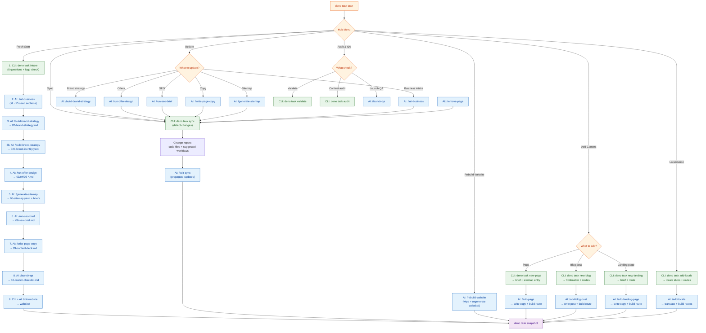

# Contenty

A strategy-first website system for AI-assisted delivery. One command
(`deno task start`) guides you through strategy, content, and implementation —
whether you're launching for the first time, rebuilding after a strategy change,
or adding a blog post.

> **One repo = one business = one website.**

---

## Prerequisites

- [Deno 2.x](https://deno.land/)
- [Git](https://git-scm.com/)
- An AI coding tool: [Windsurf](https://codeium.com/windsurf) or
  [Claude Code](https://claude.ai/)

---

## Quick Start

```bash
git clone https://github.com/your-org/contenty.git my-business-site
cd my-business-site
deno task start
```

**`deno task start` is the only command you need.** It detects your project
state, shows a checklist of what's done and what's next, and routes you to the
right action — CLI task or AI workflow. You never need to remember individual
task names.

---

## How It Works

| Folder      | Role                                                        | Who writes it                 |
| ----------- | ----------------------------------------------------------- | ----------------------------- |
| `business/` | Source of truth — strategy, offers, personas, sitemap, copy | AI skills guided by you       |
| `agency/`   | Reusable method — frameworks, schemas, rubrics, blueprints  | Pre-built (you can customize) |
| `website/`  | The actual website (Fresh 2.2+ / Tailwind 4 / Deno)         | CLI scaffold + AI content     |

The first launch is **sequential**: intake → strategy → identity → offers →
sitemap → SEO → copy → QA → build. After that, operations are **cyclical** — add
pages, write posts, update strategy, rebuild the site.

---

## System Flowchart

Three developer paths share the same business files and converge on the website.
Content operations (add page, blog, landing, locale, remove page) branch off the
main lifecycle at any point after first launch.



**Legend:** 🟢 Green = CLI command | 🔵 Blue = AI workflow | 🟠 Orange = Hub
menu | 🟣 Purple = Snapshot

### Key relationships

- **Fresh Start** is linear (1→9), used only once for initial build
- **Edit & Sync** is cyclical — edit any business file, run sync, propagate
- **Rebuild** is a reset — wipes `website/` and regenerates from `business/`
- **Content ops** (add page/blog/landing/locale) branch off at any time
  post-launch
- **Update** flows into **Sync** — changing a strategy file triggers propagation
- **Remove page** (`/remove-page`) cleans up business files, sitemap, and routes
- **Snapshot** (`deno task snapshot`) is the convergence point — saves file
  hashes for future change detection

---

## First Launch

Run `deno task start` and choose **First Launch**. The hub shows a numbered
checklist and auto-advances to the next pending phase:

| #  | Phase           | Action                      | Output                                        |
| -- | --------------- | --------------------------- | --------------------------------------------- |
| 1  | Business intake | CLI: `deno task intake`     | `business/01-business-input.yaml`             |
| 2  | Brand strategy  | AI: `/build-brand-strategy` | `business/02-brand-strategy.md`               |
| 2b | Brand identity  | AI: `/build-brand-strategy` | `business/02b-brand-identity.yaml`            |
| 3  | Offer design    | AI: `/run-offer-design`     | `business/03-*`, `04-*`, `05-*`               |
| 4  | Sitemap & IA    | AI: `/generate-sitemap`     | `business/06-sitemap.yaml`, `07-page-briefs/` |
| 5  | SEO brief       | AI: `/run-seo-brief`        | `business/08-seo-brief.md`                    |
| 6  | Page copy       | AI: `/write-page-copy`      | `business/09-content-deck.md`                 |
| 7  | Launch QA       | AI: `/launch-qa`            | `business/10-launch-checklist.md`             |
| 8  | Website build   | CLI + AI: `/init-website`   | `website/`                                    |

The hub tells you the exact slash command for both Windsurf and Claude, plus
which files will be read and written.

---

## Rebuilding the Website

After changing business files (brand identity, sitemap, copy, etc.), you can
rebuild the website to re-sync:

1. Run `deno task start` → choose **Rebuild Website**
2. The CLI wipes `website/` and regenerates a branded scaffold from `business/`
   — styles, routes, components, locale config
3. Then your AI tool populates the content using the `/init-website` workflow

### What gets regenerated (CLI)

- `website/assets/styles.css` — Tailwind `@theme` from brand identity tokens
- `website/utils/locale.ts` — locale list, RTL detection
- `website/routes/_app.tsx` — HTML shell with correct fonts
- `website/routes/*.tsx` — route stubs for every page in the sitemap
- `website/components/` — Header, Footer, Hero, CTA, Section, HrefLang
- `website/locales/*.json` — translation stubs
- Middleware for locale routing

### What needs AI re-population (workflow)

- Page copy from `business/09-content-deck.md`
- Section layouts from `business/07-page-briefs/*.md`
- SEO metadata from `business/08-seo-brief.md`
- Islands: BookingModal, MobileNav, LocaleSwitcher
- Translated UI strings in locale JSON files

The hub will warn you when branding is out of sync (brand identity file is newer
than `website/assets/styles.css`).

---

## Ongoing Operations

After first launch, run `deno task start` and pick what you need:

- **Sync** — detect business file changes, propagate to website
- **Add Content** — new page, blog post, or landing page (interactive wizards)
- **Update** — revise any strategy, copy, or SEO file via AI workflow
- **Audit & QA** — validate files, run content audit
- **Rebuild Website** — full rebuild from business files
- **Localization** — add a locale

### Content lifecycle

| Action           | CLI                     | AI Workflow         |
| ---------------- | ----------------------- | ------------------- |
| Add page         | `deno task new-page`    | `/add-page`         |
| Add blog post    | `deno task new-blog`    | `/add-blog-post`    |
| Add landing page | `deno task new-landing` | `/add-landing-page` |
| Add locale       | `deno task add-locale`  | `/add-locale`       |
| Remove page      | —                       | `/remove-page`      |
| Sync changes     | `deno task sync`        | `/edit-sync`        |

---

## Using with Windsurf

Windsurf reads `AGENTS.md` at the repo root and picks up:

- **Rules** in `.windsurf/rules/` — content quality, SEO quality, website
  standards
- **Workflows** in `.windsurf/workflows/` — slash-command automations with agent
  role context

### Slash commands

**Build workflows:**

| Command                 | Phase              |
| ----------------------- | ------------------ |
| `/fresh-start`          | Full guided build  |
| `/edit-sync`            | Propagate changes  |
| `/rebuild-website`      | Full website regen |
| `/init-business`        | Normalize inputs   |
| `/build-brand-strategy` | Brand strategy     |
| `/run-offer-design`     | Offers & personas  |
| `/generate-sitemap`     | Sitemap & IA       |
| `/run-seo-brief`        | SEO brief          |
| `/write-page-copy`      | Page copy          |
| `/launch-qa`            | Prelaunch QA       |
| `/init-website`         | Website build      |

**Content lifecycle:**

| Command             | Action         |
| ------------------- | -------------- |
| `/add-page`         | Add a new page |
| `/add-blog-post`    | New blog post  |
| `/add-landing-page` | Landing page   |
| `/add-locale`       | New language   |
| `/remove-page`      | Remove a page  |

---

## Using with Claude

Claude reads `CLAUDE.md` at the repo root and picks up:

- **Rules** in `.claude/rules/` — same quality standards as Windsurf
- **Agents** in `.claude/agents/` — enriched role definitions with source files,
  skills, rubrics, and guardrails
- **Commands** in `.claude/commands/` — all slash-command workflows (mirrors
  Windsurf)

All slash commands from the Windsurf table above work identically in Claude.

### Agents

| Agent        | Owns                                                  |
| ------------ | ----------------------------------------------------- |
| `strategist` | Positioning, audience, messaging, offers, sitemap     |
| `copywriter` | Page copy, blog posts, content deck, tone alignment   |
| `seo`        | Keywords, metadata, OG tags, schema, internal linking |
| `reviewer`   | QA across all rubrics, launch checklist               |
| `builder`    | Website implementation from business files            |

---

## Folder Map

```
business/          Source of truth
  01-business-input.yaml       Raw business facts, locales, constraints
  02-brand-strategy.md         Positioning, tone, message pillars
  02b-brand-identity.yaml      Design tokens (colors, typography, radii, shadows)
  03-business-model.md         Revenue model and offers
  04-value-proposition.md      Promise and proof
  05-personas-jobs.md          Buyer segments and jobs-to-be-done
  06-sitemap.yaml              Page inventory and navigation
  07-page-briefs/              One brief per page
  08-seo-brief.md              Keyword strategy and metadata direction
  09-content-deck.md           Implementation-ready page copy
  10-launch-checklist.md       QA findings and launch readiness

agency/            Reusable methodology
  blueprints/        Section-level page structures
  methodology/       Strategic frameworks
  rubrics/           Scoring criteria for quality review
  schemas/           YAML schemas for structured outputs
  templates/         Blank starting templates

skills/            AI instructions (each is a SKILL.md)
  brand-strategy/    Positioning, tone, trust anchors
  brand-identity/    Colors, typography, spacing, logo rules
  offer-design/      Business model, value prop, personas
  sitemap-ia/        Information architecture and page briefs
  seo-brief/         Keyword strategy, metadata, OG, JSON-LD
  page-copy/         Structured page copy
  blog-strategy/     Blog categories, content clusters, publishing plan
  launch-qa/         Prelaunch QA across all rubrics
  website-init/      Multi-locale website build with SEO + RTL

cli/               Deno automation scripts
  start.ts           Hub menu (the only command you need)
  _shared/           Shared utilities (files, prompts, state, brand-gen, dep-graph)
  intake.ts          Business intake questionnaire
  init-website.ts    Fresh scaffold + branded file generation
  sync.ts            Change detection and workflow suggestions
  validate.ts        Business files + brand assets + SEO validation
  audit.ts           Content audit (7 sections incl. SEO technical)
  ...                (new-page, new-blog, new-landing, add-locale)

website/           Implementation target (Fresh 2.2+ / Tailwind 4 / Deno)

assets/            Logos and brand files
  brand/             Logo variants (icon, horizontal, vertical, color, white, black)
  images/            Site images and references

docs/              Decision records (tech stack, analytics, handoff)

.windsurf/         Windsurf configuration
  workflows/         16 slash-command workflows with role context
  rules/             Content quality, SEO quality, website standards

.claude/           Claude configuration
  commands/          16 slash-command workflows (mirrors Windsurf)
  agents/            5 enriched agent definitions
  rules/             Content quality, SEO quality, website standards
```

---

## Operating Principle

**`business/` defines truth. `agency/` defines method. `website/` defines
implementation.**

- Never skip to code before business files are coherent
- Never invent business facts outside `business/`
- Never implement without a page brief
- Always rebuild the website from business files — not the other way around

---

## Skills vs CLI

| Layer                            | What                                          | How to use                            |
| -------------------------------- | --------------------------------------------- | ------------------------------------- |
| **Skills** (`skills/*/SKILL.md`) | AI instructions for strategy and content work | Use the slash command in your AI tool |
| **CLI tools** (`cli/*.ts`)       | Automation for scaffolding and validation     | All accessed via `deno task start`    |

Skills are invoked through slash commands (`/build-brand-strategy`,
`/write-page-copy`, etc.) — the same commands work in both Windsurf and Claude.
The hub tells you which command to run next.
